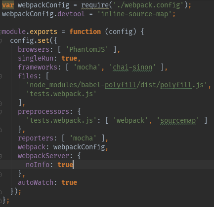

# Configuring testing environment (React, Webpack, Karma, Mocha, Chai, Sinon)

The aim of the repository is to provide clear guide of how to configure testing environment with stack listed above and how to use it with React. Repo is based on [react-webpack-starter](https://github.com/krasimir/react-webpack-starter)

## Overview - *what is* section

### Karma

Browser test runner. What Karma does is (roughly):

1. starting a small web server to serve "client-side" javascript files to be tested (1)
2. also serve the "client-side" javascript files with the tests (or Specs, as they're often called) (2)
3. serve a custom web page that will run javascript code for the tests (3)
4. start a browser to load this page (4)
5. report the results of the test to the server (5)
6. karma can then again report the results to text files, the console, anything your CI server likes, etc...

Looking at each part :

1.  Those files will be your actual js files ; you will tell karma how to load them. If you use requirejs, there is a karma plugin, and some config is needed.
2.  Those tests can be written in a variety of Javascript testing framework (Jasmine, QUnit, Mocha) ; this is JS code that is run in the browser.
3. The custom web page will be a bit different for each testing framework ; this is why karma has plugins for different frameworks.
4.  Karma can launch the page in many browsers (FF, Chrome, or headless browsers like PhantomJs.)
5.  Reporting to karma is, again, framework-dependant, and dealt with karma plugins.

### Mocha

BDD (Behaviour Driven Development) test framework:

 <br/>

Mocha doesn’t have any built-in assertion library like: Chai, should.js, expect.js etc. Common choice (and ours :) ) is Chai. You can use Mocha to run tests with Node environment. But using it with Karma enables you to run tests with different browser engines like Chrome, FF, PhantomJS (web browser without a graphical user interface).

### Chai

Chai is a BDD / TDD assertion library for node and the browser that can be delightfully paired with any javascript testing framework.

You can choose interface that you’re the most comfortable with:

 <br/>

### Sinon

Test doubles library.

Test doubles are objects that replace another objects for testing purposes. Just like actors are replaced by stunt doubles for dangerous action scenes.

As Mocha itself doesn’t provide any test double library, we need Sinon (equivalent to Jasmine spies with some additions). In Sinon test doubles are divided into 3 categories:
-	spies (to call the original function, track how many times it was called or what arguments were passed)
-	stubs (same as spies but they replace the target function + they can return values, throw exceptions, call callback functions)
-	mocks (when you would use a stub, but need to verify multiple more specific behaviors on it)

### Sinon-Chai

It just adds Chai syntax to Sinon assertions. Example:

Instead of using Sinon's assertions:

 <br/>

or awkwardly trying to use Chai's should or expect interfaces on spy properties:

 <br/>

you can say:

 <br/>

<br/>

## Configuration

### 1) Install dependencies

One global dependency: karma-cli

<br/>

Local dependencies:


If we didn’t install Karma locally, we’d need to specify explicitly in Karma config file what plugins do we use. It’s better to install Karma locally and let it find installed plugins by itself.

<br/>


Adapter - thanks to it we can specify in Karma config file (‘frameworks’ property) that Karma should use Mocha.

<br/>


It adds Chai, Sinon and sinon-chai to the mix. To use it, just put ‘sinon-chai’ in frameworks property of Karma config. And if we do so, we don’t need to put Sinon, Chai, sinon-chai separately.

<br/>


To enable Mocha style logging which is comfortable to read

<br/>


Use webpack to preprocess files in Karma

<br/>


To get source maps generated for test bundle

<br/>


Browser we want to perform tests with, e.g. PhantomJS. We need the browser itself and Karma launcher.

<br/>


If we use Phantom, we need babel-polyfill to use Promises

<br/>

### 2) Create Webpack context file to find our test files

```tests.webpack.js```

<br/>

Of course we can change search pattern to adapt it to our files structure.

<br/>

### 3) Create karma.conf.js file

```karma.conf.js```

<br/>

<br/>

### 4) Add test scripts to package.json

<br/>

The first for one-time test running, second one for let Karma watch files.

<br/>

## Usage - *how to* section

### Mocha

Mocha gives us the ability to ```describe``` the features. The ```it``` is similar but we can put only the actual assertions / expectations within it


<br/>


```describe```s can be nested in order to specify in a more detailed way what are we testing:


<br/>

While working with async code, we should pass callback to ```it()``` and when we're done with tests, invoke the callback:


<br/>

We've got different hooks available:


<br/>

All hooks may be async as well, but we need to pass and invoke callback. So before tests we can populate db or fetch some data that is to be tested.

This will pass:


<br/>

While development you can omit some tests or execute only the particular one. Mocha gives you ```only()``` and ```skip()``` for this purpose:


Use them instead of commenting tests that you want to skip. But remember to remove them before commit.


### Chai

Some examples:


Study other examples here: http://chaijs.com/api/bdd/

<br/>

### Sinon

We use Sinon when our code calls a function that is dependent on the result of another function.
This *another function* (e.g. XMLHttpRequest or mongodb.findOne) can be called *dependency*.
Thanks to Sinon we are able to replace the *problematic dependencies* with test doubles.

Sinon provides three types of test doubles: Spies, Stubs and Mocks.
Spies are the most basic, and Stubs are built on top of them so they just extend their functionality.
Mock is a mix of the previous two.

#### Spies

They gather information about function calls (e.g. number of calls or arguments passed).
Note that we invoke the original function and just spy it.

When you're done, always invoke ```yourSpy.restore()```.


#### Stubs

Stubs have all the functionality of Spies, but they completely replace original function.

Most common usages:

1. Force function to throw an error in order to test error handling:

 <br/><br/>
2. Force function to invoke callback immediately in order to test async code:

 <br/>

#### Mocks

Mocks replace the whole object so use it when you want to stub multiple methods.

Two differences though:

1. use assertions up front
2. use ```yourMock.verify()``` at the end of of your test

 <br/>

<br/>

## Testing React

Common options

1. Testing against real DOM (should be used only for lowest-level components or at all)
2. Testing against virtual DOM (more efficient, can be used to test every component)

     a. using full DOM rendering (rendering all children components)

     b. using shallow rendering (rendering only current component without children) - if you don't need children, use this option as it is the most efficient and children will not affect your test

<br/> <br/> <br/>

<sub><sup>
sources:<br/>
</sup></sub>
<sub><sup>
http://stackoverflow.com/questions/26032124/karma-vs-testing-framework-jasmine-mocha-qunit<br/>
http://thejsguy.com/2015/01/12/jasmine-vs-mocha-chai-and-sinon.html<br/>
https://scotch.io/tutorials/what-is-phantomjs-and-how-is-it-used<br/>
https://mochajs.org<br/>
http://chaijs.com/<br/>
https://semaphoreci.com/community/tutorials/best-practices-for-spies-stubs-and-mocks-in-sinon-js<br/>
http://krasimirtsonev.com/blog/article/a-modern-react-starter-pack-based-on-webpack<br/>
http://staxmanade.com/2015/11/testing-asyncronous-code-with-mochajs-and-es7-async-await<br/>
https://www.sitepoint.com/sinon-tutorial-javascript-testing-mocks-spies-stubs<br/>
http://reactkungfu.com/2015/07/approaches-to-testing-react-components-an-overview
</sup></sub>